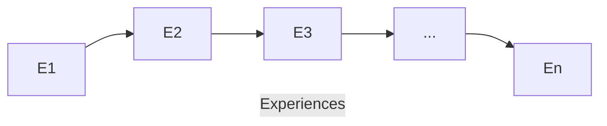

# What is Continual Learning?

## Introduction 
- Deep Learning hold *state-of-the-art* performances in many tasks due to supervised training on **huge** and **fixed** datasets.

- Main problem being solved by Deep Learning: **Curse of Dimensionality**.

- How can we improve AI **efficiency**, **scalability** and **adaptability** to make it sustainable in the long term?

## Continual Learning Goal

- Higher and **realistic time-scale** where data (and tasks) become available only during a time.
- **No access** to previously encoundered data.
- **Constant** computational and memory resources (Efficiency).
- **Incremental development** of ever more complex knowledge and skills (Scalability).
- **Efficiency + Scalability = Sustainability**.

## Catastropic Forgetting 

*Catastrophic interference*, also known as ***catastropic forgetting***, is the tendency of neural network to completely and abruptly ***forget*** previously learned information upon learning new information. Mostly due to Gradient Descent. 

## Stress Point

Continual learning aim is not for incremental improvement of *SOTA*, but rather paradigm-changing approaches to machine learning that enable systems to continously improve based on experience.

In continual learning we can only access the **current data** from the series of experience:

# Relationship with Other Learning Paradigms

# Brief History of Continual Learning