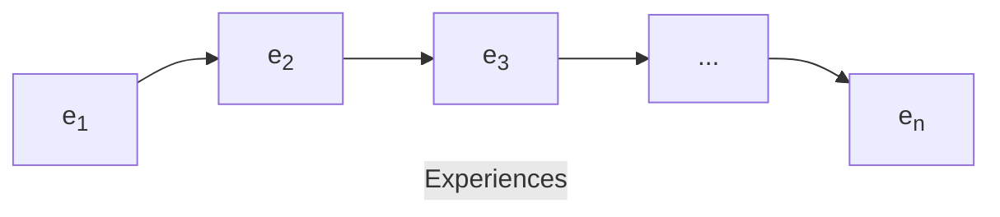

# What is Continual Learning?

## Introduction

- Deep Learning hold *state-of-the-art* performances in many tasks due to supervised training on **huge** and **fixed** datasets.

- Main problem being solved by Deep Learning: **Curse of Dimensionality**.

- How can we improve AI **efficiency**, **scalability** and **adaptability** to make it sustainable in the long term?

## Continual Learning Goal

- Higher and **realistic time-scale** where data (and tasks) become available only during a time.
- **No access** to previously encoundered data.
- **Constant** computational and memory resources (Efficiency).
- **Incremental development** of ever more complex knowledge and skills (Scalability).
- **Efficiency + Scalability = Sustainability**.

## Catastropic Forgetting

*Catastrophic interference*, also known as ***catastropic forgetting***, is the tendency of neural network to completely and abruptly ***forget*** previously learned information upon learning new information. Mostly due to Gradient Descent.

## Stress Point

Continual learning aim is not for incremental improvement of *SOTA*, but rather paradigm-changing approaches to machine learning that enable systems to **continously improve based on experience**.

In continual learning we can only access the **current data** from sequence series of experience $S = e_1, ..., e_n$:

## Continual Learning Formulation

### Signature of the Continual Learning Algorithm

A continual learning algorithm $A^{CL}$ is defined as a function with the following signature:

$$A^{CL}: \langle f^{CL}_{i-1}, D^i_{train}, M_{i-1}, t_{i} \rangle \rightarrow \langle f^{CL}, M_{i} \rangle,$$

- $f^{CL}$: The model learned after training on experience $e_i$.
- $D^i$: A batch of samples from experience $e_i$, consisting of a tuple $\left \langle x^i, y^i \right \rangle$.
- $M_{i}$: A buffer of past knowledge, such as previous samples or activations, stored from previous experiences, usually of a fixed size.
- $t_i$: A task label which may be used to identify the correct data distribution.

### Objective of the Continual Learning Algorithm

The objective of the continual learning algorithm ($CL$) is to minimize the loss $L_s$ over the entire stream of data $S$:

$$L_S(f_{n}^{CL}, n) = \frac{1}{\sum^n_{i=1} \left | D^i_{test} \right |} \sum_{i=1}^{n} L_{exp}(f_n^{CL}, D^i_{test}),$$

- $L_s$: The loss function over the entire stream of data $S$.
- $f_{n}^{CL}$: The model after training on the $n$-th experience.
- $D^i_{test}$: A batch of test samples from experience $e_i$.
- $L_{exp}(f_n^{CL}, D^i_{test})$: The loss computed on a single sample $\left \langle x, y \right \rangle$, such as cross-entropy in classification problems.

In summary, the continual learning algorithm is designed to update the model ($f^{CL}$), based on new experiences ($D^i_{train}$), store relevant information in a knowledge buffer ($M_{i}$), and minimize the loss over the entire stream of data ($L_S$) to adapt to changing tasks or data distributions over time.+

### Requirements of Coninual Learning Algorithm

1. **Replay-Free Continual Learning**:
The goal is to enable continual learning without relying on the strategy of replaying or revisiting past experiences (previous data). In other words, the algorithm should be capable of learning from new data without needing to explicitly go back and train on all the previously seen data. Because constantly replaying all past data may not be feasible in real-world scenarios where data is abundant or expensive to store and process.

2. **Memory and Computationally Bounded**:
The algorithm should operate within constraints, both in terms of memory and computation. It should be designed to work with limited resources and not excessively consume memory or computational power. Because in the real-world applications often have resource constraints, and a CL algorithm that is memory and computationally bounded is more practical and scalable.

3. **Task-Free Continual Learning**:
The algorithm should be able to learn from new experiences without explicitly knowing the task labels. In other words, it should be able to adapt to new types of data or tasks without task-specific information. Because the nature of tasks might change overtime or label are not always available.

4. **Online Continual Learning**:
The learning process should be continuous and incremental, adapting to new data as it arrives. The algorithm should be capable of learning and updating the model in an online fashion without requiring batch processing of all data. Because data come continously and the model need to adapt quickly without waiting for all data being collected before updating.

## Terminology & Related Paradigms

### Unconsolidated Nomenclature

A list of terms that are often used interchangeably or are closely related in the context of learning paradigms:

- **Continual Learning**
- **Incremental Learning**
- **Liefelong Learning**
- **Continous Learning**

### Related Paradigm

A list paradigms or approaches related to continual learning. Each of these paradigms has its unique characteristics and goals:

- **Multi-Task Learning:**
Involves training a model to perform multiple tasks simultaneously, leveraging shared knowledge across tasks to improve overall performance. Example: Object Detection + Instance Segmentation (e.g., MaskRCNN).

- **Meta-Learning / Learning to Learn:**
Focuses on developing models that can learn how to learn. These models are trained on a variety of tasks, enabling them to adapt quickly to new tasks with limited data. Example: Few-shot Learning (e.g., Model-Agnostic Meta-Learning (MAML)).

- **Transfer Learning & Domain Adaptiation:**
Transfer learning involves leveraging knowledge gained from one task to improve performance on another task. Domain adaptation specifically deals with adapting a model trained on one domain to perform well on a different but related domain. Example: Pre-trained Language Models (e.g., BERT and GPT).

- **Online / Streaming Learning:**
Online learning involves updating a model continuously as new data becomes available, often in a streaming fashion. This is suitable for scenarios where data arrives sequentially. Example: Vowpal Wabbit.

## History Timeline

1. Incremental learning with rule-based systems (‘70s - ‘80s)
2. Forgetting in Neural Networks (French, 1989)
3. Incremental learning with Kernel Machines (‘90s)
4. Continual Learning (Ring, 1998)
5. Lifelong Learning (Thrun, 1998)
6. Never-Ending Learning (Mitchell, 2009)
7. Deep Continual Learning (Kirkpatrick, 2016)
8. Lifelong (Language) Learning (Liu, 2018)
